# 🍽️ Restaurant Data ELT Pipeline (Final Project Submission)

## 1. Project Overview and Architectural Design

This project delivers a robust, automated **Extract, Load, Transform (ELT)** data pipeline designed to integrate disparate data sources for a restaurant chain. We implemented a foundational **Layered Architecture (Medallion Pattern)**—Bronze, Silver, and Gold—to ensure data quality, traceability, and structured consumption by non-technical users.

### Core Technologies

| Tool | Role in Pipeline | Key Implementation Detail |
| :--- | :--- | :--- |
| **Dagster** | **Orchestration & Scheduling** | Defines the data assets and their dependencies ($\text{B} \to \text{S} \to \text{G}$) and schedules the pipeline daily via a **Cron Schedule**. |
| **DuckDB** | **Transformation Engine (SQL)** | Used for high-speed, in-process analytical SQL processing to clean data and calculate final metrics. |
| **Azure Blob Storage** | **External Ingestion** | Securely extracts support tickets using an Environment Variable-managed SAS key. |
| **Pandas** | **Data Manipulation** | Handles DataFrame operations for reading CSVs, initial cleaning, and preparing data for DuckDB. |
| **Parquet / CSV** | **Storage Formats** | Maintains raw data fidelity (CSV) in the Bronze layer and uses optimized columnar storage (Parquet) for all analytical outputs (Silver/Gold). |


---

## 2. Layered Data Pipeline Flow

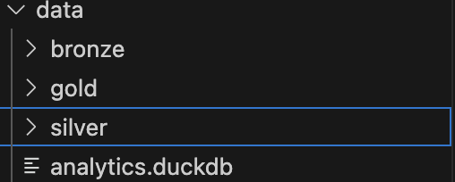

### 2.1. Bronze Layer: Raw Ingestion (CSV)

This layer is the persistent landing zone for raw, untouched source data.

* **Ingestion:** Data is extracted from 6 local CSV files (customer, order, product details) and the remote JSONL stream (support tickets).
* **Transformation:** Files are loaded into persistent raw CSV files in the `data/bronze` directory.
* **Key Scripts:** All ingestion logic is contained within functions like `create_raw_csv_asset` and `raw_support_tickets_bronze` in `assets.py`.

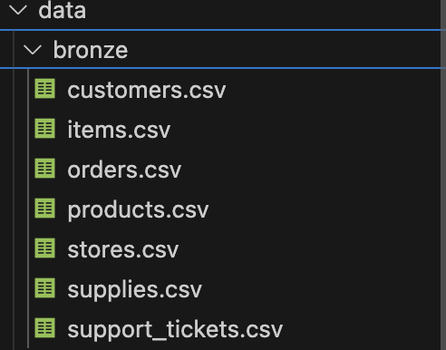

### 2.2. Silver Layer: Cleaned Fact Table (Parquet)

This layer cleans, normalizes, and joins the core business entities. The heavy lifting is performed by SQL queries executed in DuckDB.

* **Asset:** `joined_orders_tickets_silver`
* **Processing:** The asset connects to the DuckDB file, registers the Bronze Pandas DataFrames, and executes a SQL `LEFT JOIN` on `order_id` to link all orders with their respective support tickets.
* **Data Quality:** Column renaming (`customer` to `customer_id`) and a crucial new flag (`has_support_ticket`) are added here.
* **Output:** The final, cleaned `fct_orders_tickets.parquet` is created in `data/silver`.


### 2.3. Gold Layer: Business Marts (Parquet)

This final layer delivers actionable, aggregated metrics directly consumable by reporting tools.

* **Analytical Requirements Fulfilled:**
    1.  **Average Order Value (AOV)**
    2.  **Number of Tickets for Each Order**
* **Processing:** Two separate Gold assets execute optimized SQL aggregation queries against the Silver layer data within DuckDB and export the final reports to Parquet files in `data/gold`.

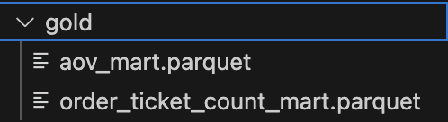

---

## 3. Automation and Verification

### 3.1. Pipeline Scheduling

The project is configured for scheduled ingestion to run automatically, fulfilling the project's requirement for pre-determined time periods.

* **File:** `restaurant_pipeline/definitions.py`
* **Configuration:** A `ScheduleDefinition` is set with a Cron expression to trigger the entire ELT job daily.
* **Current Schedule:** The pipeline is scheduled to run daily at **01:00 AM CET** (or the time requested for immediate demonstration).

Schedule Started (Dagster UI)
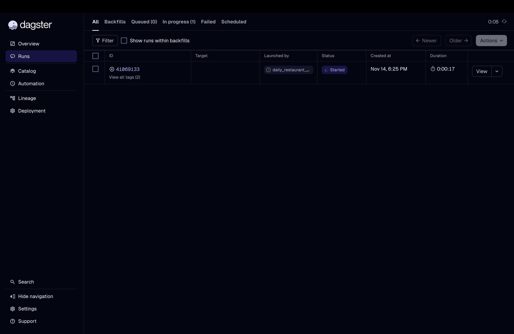

Schedule Started (CLI)
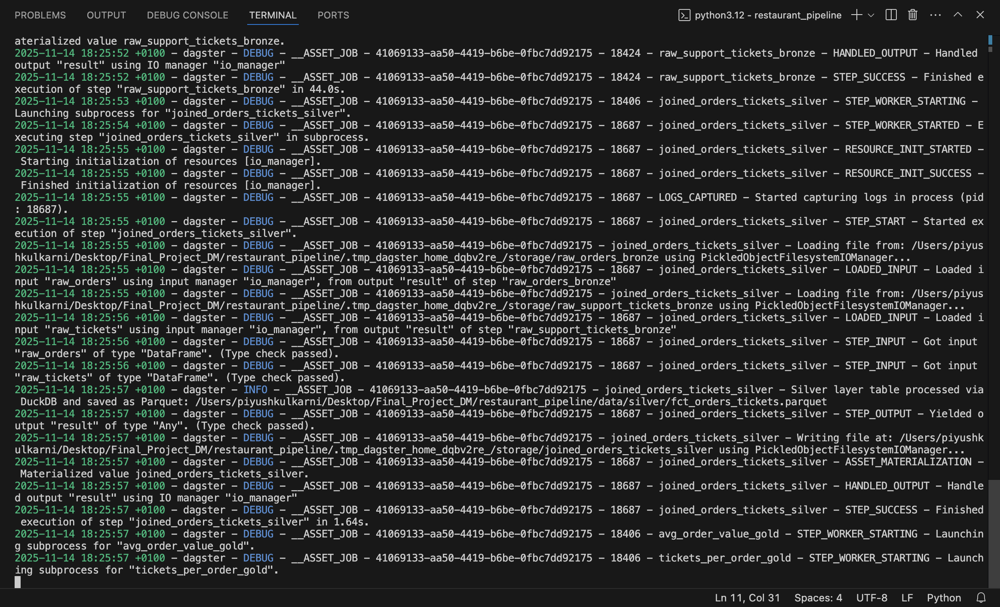

Materializing Schedule (Dagster UI)
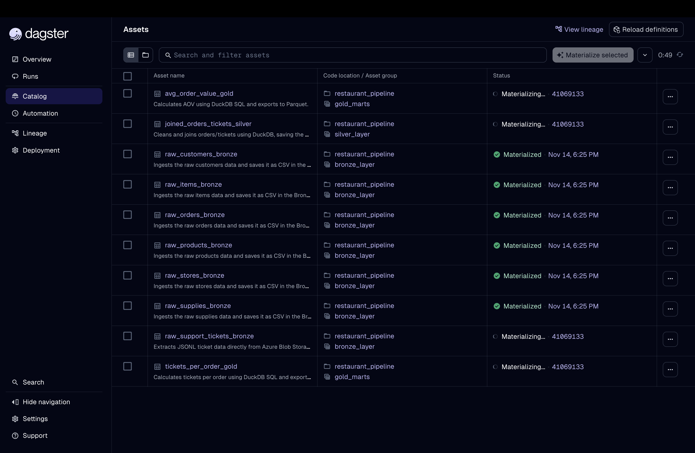

Schedule Started (Dagster UI)
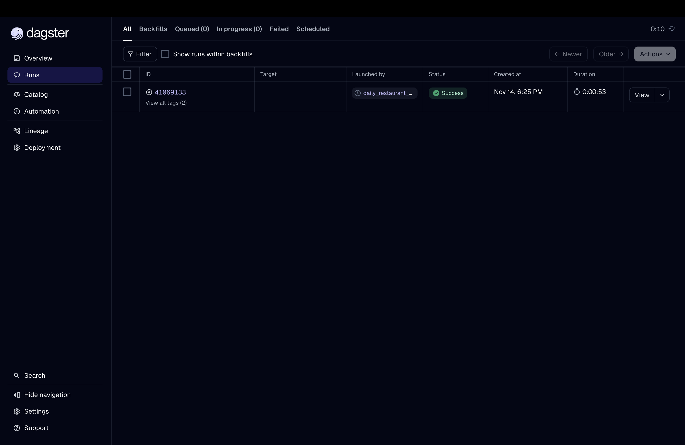


### 3.2. Code Structure and Key Files

The directory structure follows Dagster's recommended project layout, separating application code from tests and data artifacts.
```text
.
├── data                              # Data Lake Storage (Medallion Layers)
│   ├── analytics.duckdb                # DuckDB file: Used as the transformation engine
│   ├── bronze                          # Layer 1: Raw, Unprocessed Data (CSV)
│   │   ├── customers.csv                 # Raw data from local files
│   │   ├── items.csv                     # Raw data from local files
│   │   ├── orders.csv                    # Raw data from local files
│   │   ├── products.csv                  # Raw data from local files
│   │   ├── stores.csv                    # Raw data from local files
│   │   ├── supplies.csv                  # Raw data from local files
│   │   └── support_tickets.csv           # Raw data ingested from Azure Blob Storage
│   ├── gold                            # Layer 3: Final Analytical Marts (Parquet)
│   │   ├── aov_mart.parquet              # Gold Mart: Calculated Average Order Value
│   │   └── order_ticket_count_mart.parquet # Gold Mart: Calculated Tickets Per Order
│   └── silver                          # Layer 2: Cleaned, Joined Fact Data (Parquet)
│       └── fct_orders_tickets.parquet  # Silver Fact Table: Cleaned Orders joined with Tickets
├── inspect_data.py                   # Verification Script: Connects to DuckDB/reads Parquet for QA
├── pyproject.toml
├── raw_data                          # Source Data: Local files (ignored in data/bronze)
│   ├── raw_customers.csv
│   ├── raw_items.csv
│   ├── raw_orders.csv
│   ├── raw_products.csv
│   ├── raw_stores.csv
│   └── raw_supplies.csv
├── README.md                         # Project Documentation (The submission file)
├── restaurant_pipeline               # Dagster Code Modules (Application Logic)
│   ├── __init__.py                     # Python package initialization
│   ├── __pycache__
│   ├── assets.py                       # CORE ELT LOGIC: All Bronze, Silver, Gold asset definitions
│   └── definitions.py                  # DAGSTER CONFIG: Loads assets, defines Schedules/Jobs
├── restaurant_pipeline_tests         # Testing Module
│   ├── __init__.py
│   ├── __pycache__
│   └── test_assets.py                  # Unit and Integration Tests for B/S/G layers
├── setup.cfg
└── setup.py

10 directories, 32 files

```

### 3.3. Verification of Results

The `inspect_data.py` script serves as the proof-of-value, reading the final Parquet outputs and verifying the metric calculations by querying the analytical tables.

| Metric | Check | Output Confirmation |
| :--- | :--- | :--- |
| **Silver Fact Table** | Data types, row count (400,423), column renaming (`customer_id`). | **SUCCESS** |
| **AOV Mart (Gold)** | Single row containing the average `order_total`. | **SUCCESS** (e.g., Value: 1045.77) |
| **Ticket Mart (Gold)** | Count of tickets per unique order ID ($\ge 1$). | **SUCCESS** (e.g., Total orders with tickets: 63,043) |

Inspect (CLI)
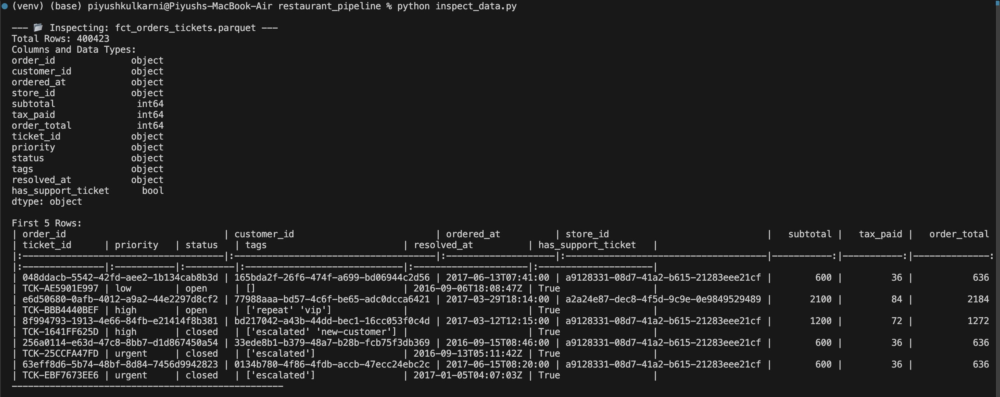
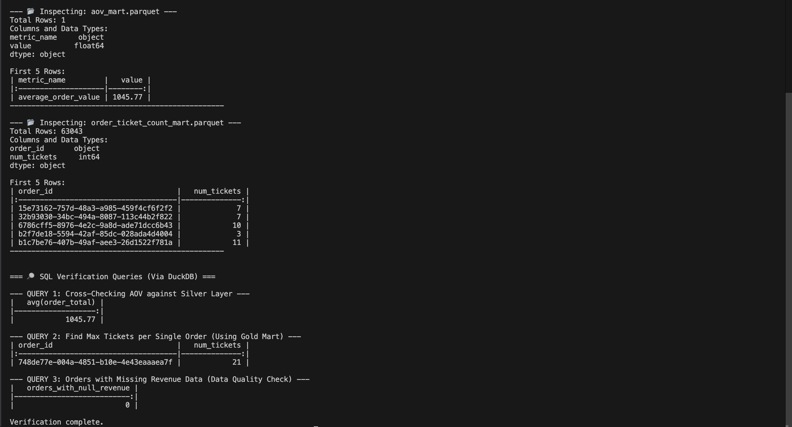


## 3. Dagster Lineage and Job (UI)

1. Lineage
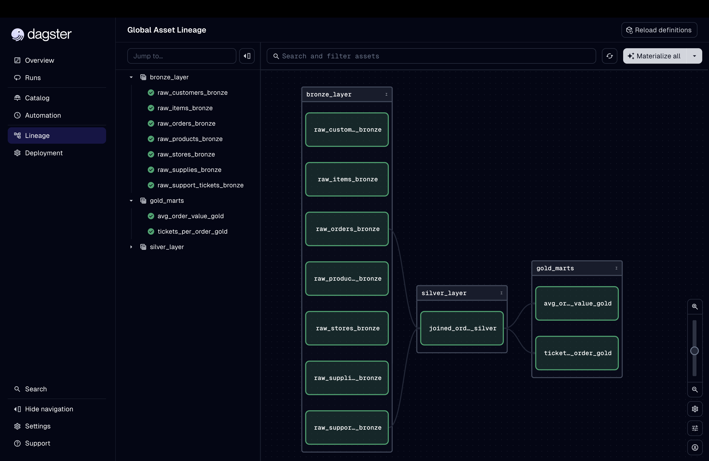

2. Job
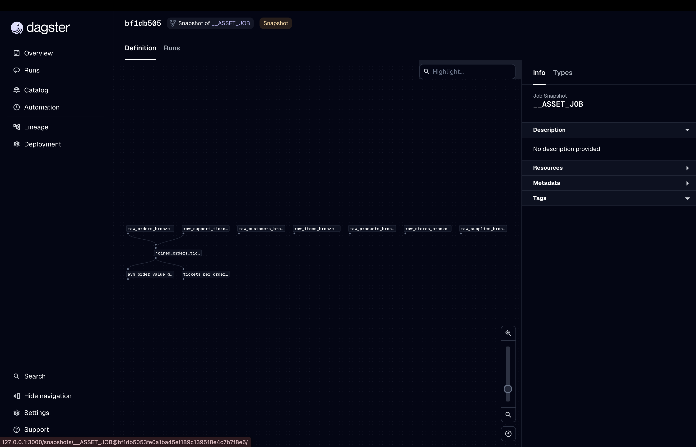